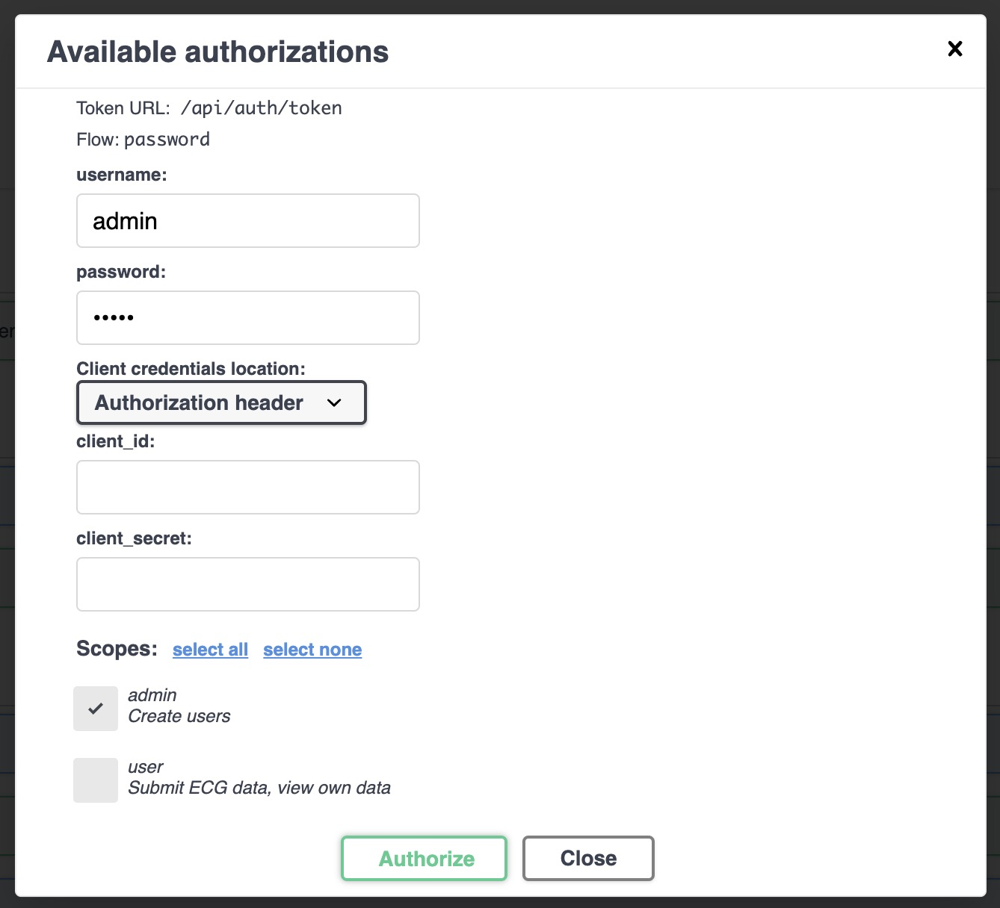
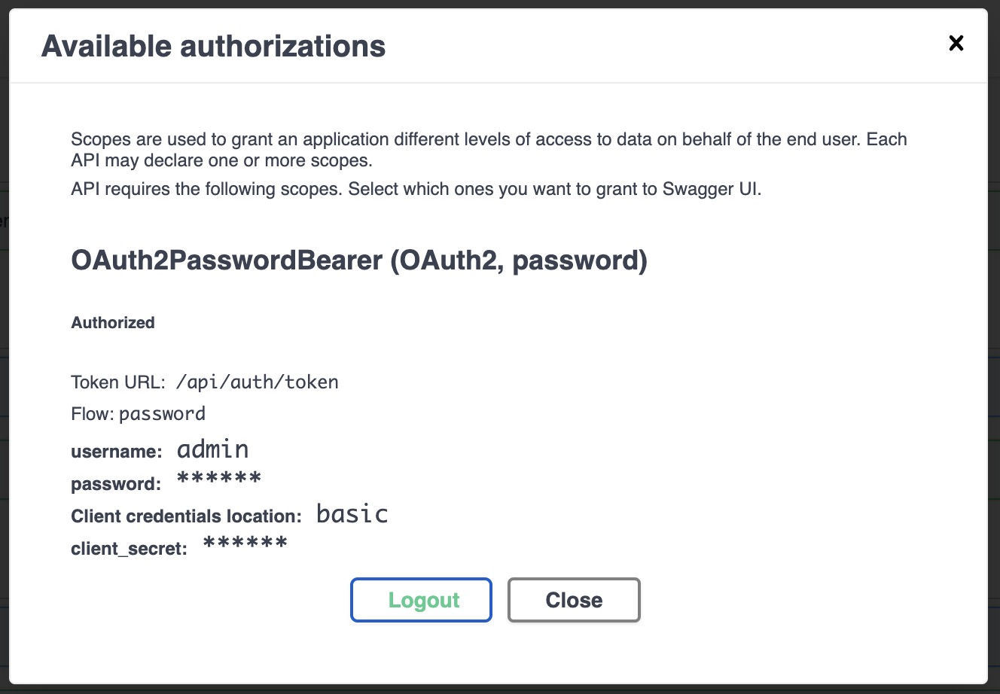
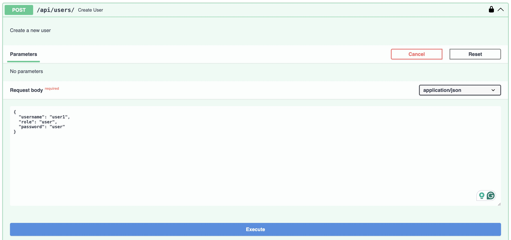
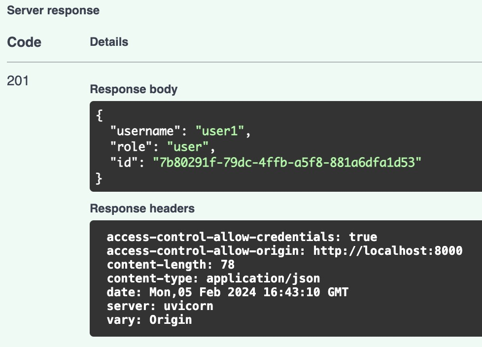

# Create Users

This app has two different scopes or roles:

- **Admin**: Can create and manage users.
- **User**: Can upload and view ECGs.

To create a user, you need to be an admin. To create an admin, you need to run the following command:

```bash
scripts/create_superuser.sh <username>
```

If you followed the quickstart and run `./run_dev.sh` you
will already have the admin user with permissions to create new users.

## Login as admin

To login as admin, go to [http://localhost:8000/api/docs](http://localhost:8000/api/docs) and click on the `Authorize` button. Then, fill in the form with the following data:

- username: `admin`
- password: `<password>`
- scope: `admin`






## Create a new user

To create a new user, go to [http://localhost:8000/api/docs](http://localhost:8000/api/docs) and click on the `POST /users/` endpoint. Then, fill in the form with the following data:

- username: `<username>`
- role: `user`
- password: `<password>`



Click on Execute button and you will see the response with the new user data.


