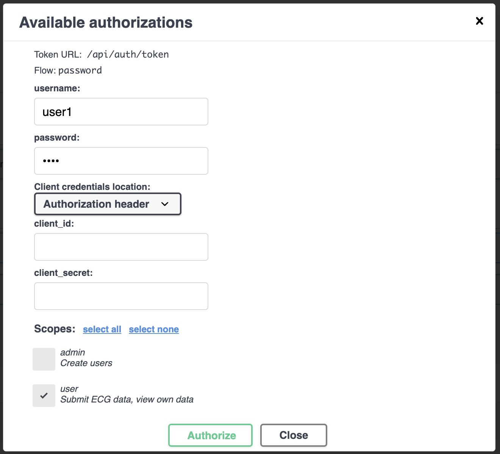
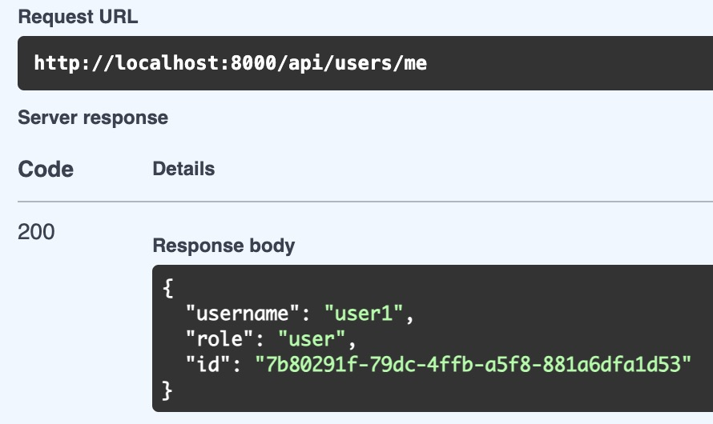

# User login

Once you have your user created (with role `user`) you can login the same way you did with the admin user. Go to [http://localhost:8000/api/docs](http://localhost:8000/api/docs) and click on the `Authorize` button. Then, fill in the form with the following data:

Now you can use the user and ECG endpoints to upload and view ECGs.

