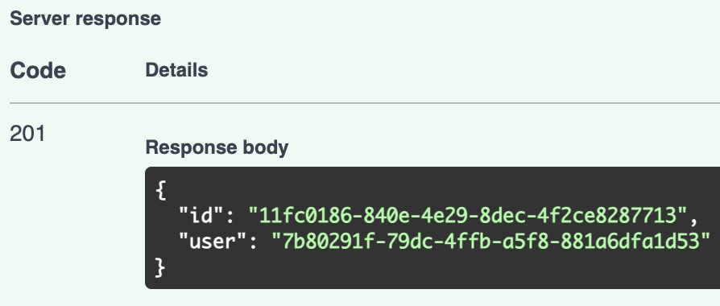
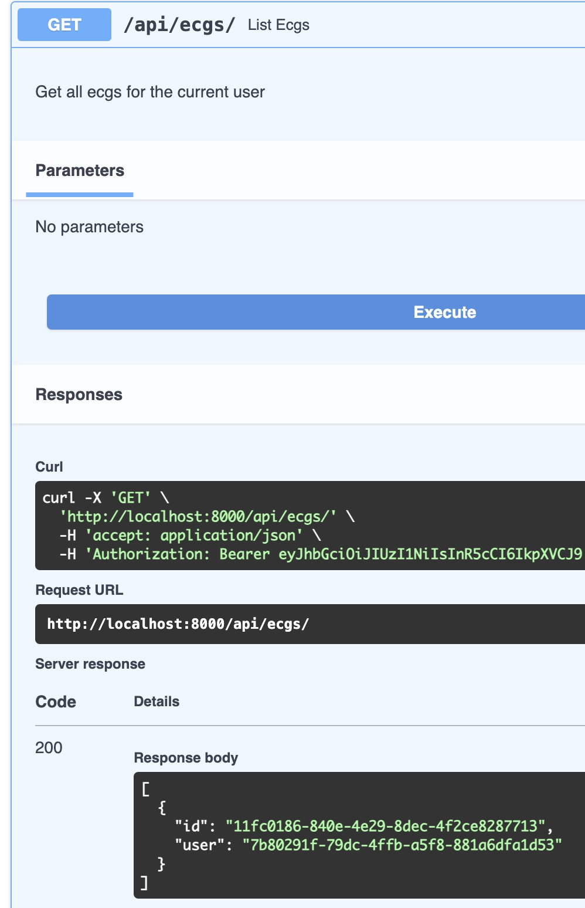

# Upload ECG

To upload an ECG, you need to be logged in as a user. If you are not logged in, you can follow the instructions in the [User login](auth/user_login.md) section.

Once you are logged in, go to [http://localhost:8000/api/docs](http://localhost:8000/api/docs) and click on the `POST /api/ecgs/` endpoint. Then, fill in the form with the following data:

- file: `<file>` (There is a sample file in `assets/example_ecg.json`)

Once you click on the `Execute` button, you will see the response with the new ECG data.

Now you can list the ECGs and view the details of the new ECG.

List ECGs: [http://localhost:8000/api/docs#/ECGs/list_ecgs_ecgs_get](http://localhost:8000/api/docs#/ECGs/list_ecgs_ecgs_get)

## Technical considerations

The API is designed to be performant and scalable. You can upload
big JSON files, since the app uses a streaming approach to parse the data and store it in the database.

The JSON file is parsed in streaming using [ijson](https://github.com/ICRAR/ijson?tab=readme-ov-file#lower-level-interfaces) library and the data is sent to the database in chunks. This way, the app can handle big files without consuming a lot of memory.

## ECG Signal processors

Every time you upload an ECG, the app will first store the raw data in the database and then it triggers background tasks to process the data and store the results in the database.

### Adding Signal processors

There is an abstract base class `SignalProcessor` that you can use to create new signal processors. You can find the base class in the `ecg_backend.processors` module.

To create a new signal processor, you need to create a new class that inherits from `SignalProcessor` and implement the `process` method. This method will receive the ECG data and should return the processed data.

There is no need to register the new processor in the app. The app will automatically find the new processor and trigger it when an ECG is uploaded.

In this case I opted to use introspection to find the processors
to avoid more external dependencies, but this feature can also be implemented using the [Observer design pattern](https://en.wikipedia.org/wiki/Observer_pattern).

### NumCrossesZeroSignalProcessor

This processor calculates the number of times the signal crosses the zero line. You can find the implementation in the `ecg_backend.processors.num_crosses_zero` module.

The implementation uses a raw PostgreSQL query to calculate the number of times the signal crosses the zero line. It is a simple
way to implement it, since the data is already stored in the PostgreSQL database, but in future implementations, we could use a more efficient way to calculate this value.
