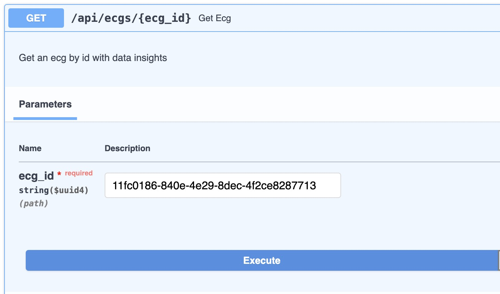

# ECG detail

Go to [http://localhost:8000/api/docs#/ecgs/get_ecg_api_ecgs__ecg_id__get](http://localhost:8000/api/docs#/ecgs/get_ecg_api_ecgs__ecg_id__get) and click "Try it out". Then, fill in the form with the following data:

- ecg_id: `<ecg_id>`




Once you click on the `Execute` button, you will see the response with the ECG data.

The response will contain all the analyses that were triggered when the ECG was uploaded. 

```json
{
  "id": "11fc0186-840e-4e29-8dec-4f2ce8287713",
  "user": "7b80291f-79dc-4ffb-a5f8-881a6dfa1d53",
  "analyses": [
    {
      "id": "fdf312fa-6b7f-435d-a966-80eb5cd6ab48",
      "ecg_id": "11fc0186-840e-4e29-8dec-4f2ce8287713",
      "created": "2024-02-05T18:26:15.966971",
      "finished": "2024-02-05T18:26:15.979446",
      "name": "num_crosses_zero",
      "status": "completed",
      "result": {
        "aVF": 50,
        "aVL": 37,
        "aVR": 48,
        "I": 47,
        "II": 48,
        "III": 61,
        "V1": 45,
        "V2": 47,
        "V3": 53,
        "V4": 45,
        "V5": 48,
        "V6": 55
      },
      "duration": 0.012475
    }
  ]
}
```